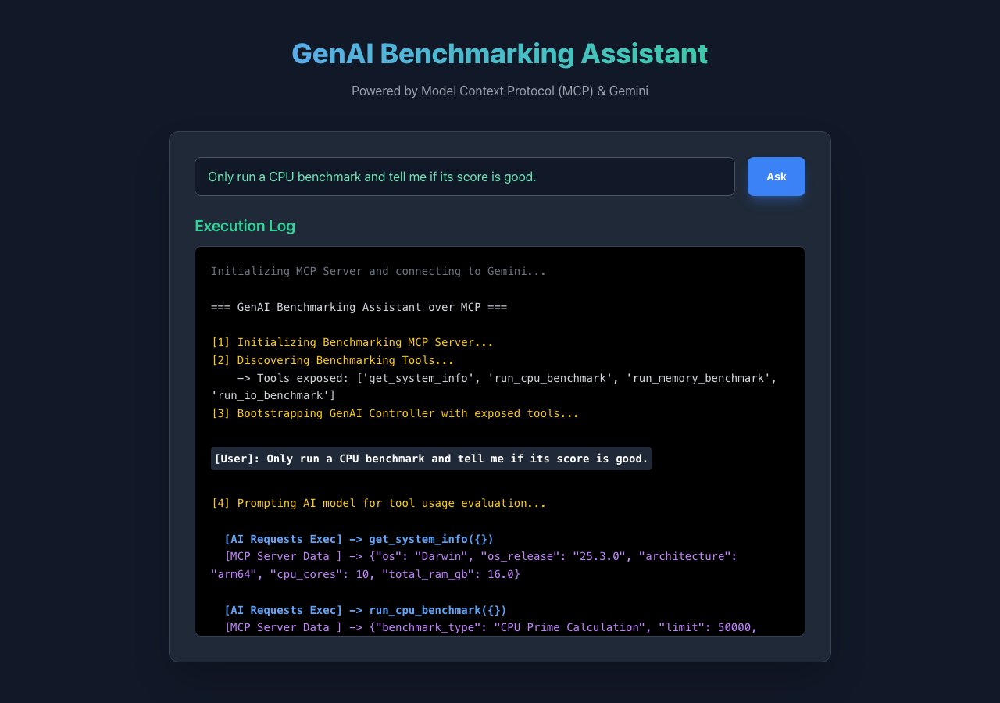
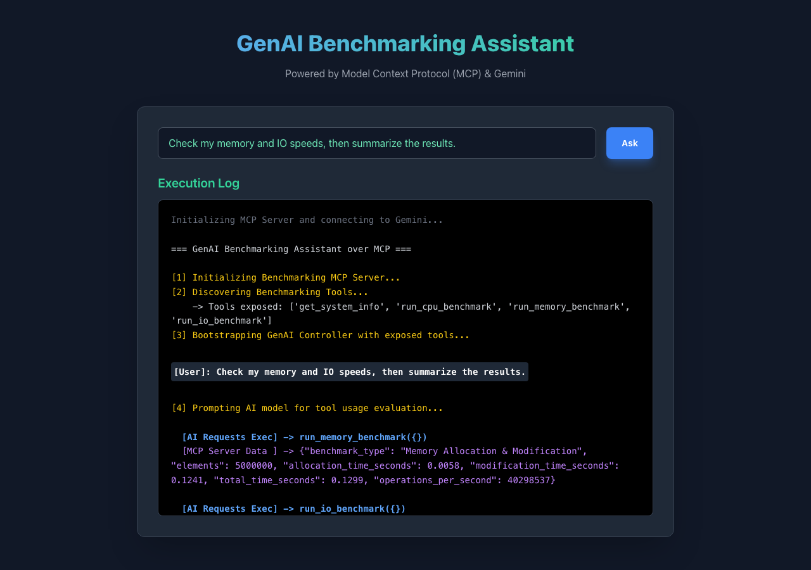

# mcp-bench

Welcome to **mcp-bench**! This project is a system benchmarking tool that uses AI to run tests and analyze your computer's performance.

If you are a new Python programmer, this is a great example of how to connect a large language model (like Gemini) to actual Python code that runs on your local machine. We do this using the **Model Context Protocol (MCP)**.

## What is this project doing?

Normally, an AI like ChatGPT or Gemini is stuck in the cloud. It doesn't know how much RAM your computer has, and it can't run a speed test on your CPU. 

This project bridges that gap by giving the AI "tools" it can use.

Here is how it works step-by-step:
1. **You ask a question**: You type something like, *"Is my CPU fast?"*
2. **The AI receives the question**: The AI realizes it needs to run a CPU benchmark to answer your question.
3. **The AI asks for data**: The AI sends a message saying, *"Hey, please run the tool called `run_cpu_benchmark` for me."*
4. **The Python Server obeys**: Our local Python script (`mcp_server.py`) actually runs the heavy math calculations on your computer to test the CPU, and gets a score.
5. **The Python Server replies**: The script sends the score back to the AI.
6. **The AI gives you the answer**: The AI reads the score and writes a human-friendly response like, *"Your CPU scored 300,000, which is very fast!"*

## Why use MCP? (The Architecture)

We use the **Model Context Protocol (MCP)** to keep things organized and secure. We split the code into two main parts:

1. **The Server (`mcp_server.py`)**: This script contains the actual Python benchmarking functions (like measuring IO speeds). It acts as a menu, saying "Here are the 4 tools I know how to run."
2. **The Client (`mcp_client.py`)**: This script talks to the Gemini API. It shows the AI the "menu" of tools from the server. When the AI wants to use a tool, the client passes the message to the server, waits for the result, and gives it back to the AI.

This separation means the AI is safely restricted. It can't run arbitrary commands on your computer; it can *only* run the specific benchmarking tools you provided in the server script!

---

## Deliverables inside this folder

1. **`mcp_server.py`**: The MCP Server. Exposes `get_system_info()`, `run_cpu_benchmark()`, `run_memory_benchmark()`, and `run_io_benchmark()`.
2. **`mcp_client.py`**: The MCP Client. Instantiates Gemini, fetches the tools, asks the model to benchmark the system, fields its tool usages, and prints the AI's final system analysis.
3. **`sample_benchmark.json`**: An example payload of what the underlying MCP raw tool outputs look like when aggregated.

## Prerequisites

1. Install required dependencies:
   ```bash
   pip install google-generativeai flask python-dotenv
   ```
2. Create a `.env` file in the root directory and add your key:
   ```bash
   GEMINI_API_KEY="your-gemini-api-key"
   ```

## Example Run

### Web UI (Tailwind CSS)

You can run a beautiful web interface to interact with the benchmarking assistant:

```bash
# Ensure you are using the virtual environment if applicable
python3 app.py
```
Then, open `http://127.0.0.1:5001/` in your browser.

**Features:**
- Type a custom prompt in the chatbox, e.g., *"Just check my memory and IO speeds."*
- Click **Send & Run** to let Gemini run the corresponding tools and stream the insights back!


### CLI Mode

You can also run the client directly from the command line, and optionally provide a custom prompt:

```bash
python3 mcp_client.py --prompt "Only run the CPU benchmark and tell me if it's fast enough."
```

### Example Prompts

Here are a few different demo command prompts you can try to see how the GenAI controller uses its available tools in real time.

**Prompt triggering a single API/tool:**
* *"Only run a CPU benchmark and tell me if its score is good."* -> Triggers `run_cpu_benchmark()`
* *"What is my system info?"* -> Triggers `get_system_info()`



**Prompt triggering multiple APIs/tools sequentially:**
* *"Check my memory and IO speeds, then summarize the results."* -> Triggers `run_memory_benchmark()` and `run_io_benchmark()`
* *"Run all performance diagnostics to give me a hardware analysis."* -> Triggers `get_system_info()`, `run_cpu_benchmark()`, `run_memory_benchmark()`, and `run_io_benchmark()`



### Flow Outcome
1. Handshake establishes JSON-RPC connection.
2. Tools are discovered and fed to Gemini's schema parameters.
3. Gemini decides to use `get_system_info`, `run_cpu_benchmark`, `run_memory_benchmark`, and `run_io_benchmark`.
4. The isolated MCP server executes these, returning metrics like CPU scores, memory operations/sec, and disk read/write bandwidth in JSON.
5. Gemini digests the JSON structured data and summarizes bottlenecks and insights into a friendly AI Analyst Report.
